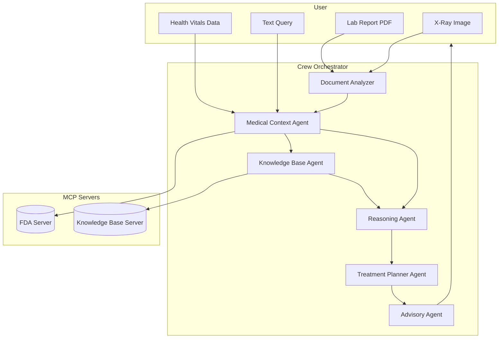

# 🏥 CareCrew — AI Clinical Co-pilot  

  
  
  
  
  

---

**CareCrew is an AI-powered clinical co-pilot designed to reduce diagnostic errors and save clinicians time.**  

It acts as an intelligent assistant that ingests multiple forms of medical data (PDFs, X-Rays, text), reasons over them, and provides a clear, actionable summary grounded in verified medical sources. By using **Groq**, it delivers sub-second inference, making it fast enough for real-world clinical use.  

---

## 🚀 Submission Checklist  
- [x] **Demo Video (≤ 3 mins):** `[Link to Your Demo Video]`  
- [ ] **Live Deployment URL** — *Not applicable (local-first for data privacy)*  
- [x] **Comprehensive Local Run Steps**  
- [x] **≥2 Specialized Agents** (✅ 6 agents implemented)  
- [x] **Robust `FastAPI` Architecture**  
- [x] **Multimodal Inputs Demonstrated** (PDFs, X-rays, text)  
- [x] **Dependencies Listed** (`requirements.txt`)  
- [x] **Architecture Diagram Included**  
- [x] **Ethics & Safety Considerations**  

---

## 🧩 The Problem: Clinical Data Overload  
Healthcare professionals are drowning in data: lab reports, imaging files, prescriptions, and constantly updated medical guidelines.  

Manually synthesizing this information is:  
- **Time-Consuming:** Clinicians spend hours on data entry and review instead of with patients.  
- **Error-Prone:** It's easy to miss a critical lab value or a drug interaction in a complex report.  
- **Stressful:** The cognitive load contributes to burnout and decision fatigue.  

This can lead to delayed diagnoses, medical errors, and poorer patient outcomes.  

---

## 💡 Our Solution: An AI Co-Pilot  

**CareCrew** acts as an AI co-pilot that automates the "heavy lifting" of data analysis.  

It uses a team of six specialized agents to mimic a clinical review process. You provide the raw data, and CareCrew generates a concise, verified summary for a human expert to approve.  

**How it Works:**  
1. **Ingest:** The user uploads multiple files (lab reports, X-rays, patient notes).  
2. **Analyze:** A **Document Analyzer** agent extracts key information.  
3. **Reason:** A **Reasoning Agent** and **Context Agent** cross-reference the data (e.g., "This lab value is high *for this specific patient's condition*").  
4. **Verify:** The **KB Agent** and **Treatment Planner** query external, trusted sources (via our `FastAPI` servers) to check against **FDA data** and **medical guidelines**.  
5. **Summarize:** The **Advisory Agent** writes a simple, multilingual report for the doctor or patient.  

This entire process, powered by **Groq**, happens in seconds.  

---

## ✨ Our Innovative System Architecture  

CareCrew is built as a **stable, scalable, and intelligent multi-agent system** designed for real-world clinical reliability. It combines production-grade engineering with AI-driven reasoning for safe and explainable decision support.  

---

### 🧩 1. Production-Ready FastAPI Microservice Design  
CareCrew runs on a robust **FastAPI** architecture with two dedicated servers:  
- **`mcp_server_fda.py`** → Handles all requests for FDA drug safety and regulatory data.  
- **`mcp_server_kb.py`** → Handles all RAG (Retrieval-Augmented Generation) queries to the internal medical knowledge base.  

**Why it’s better:**  
- Each server runs independently — faster, more stable, and scalable.  
- It avoids monolithic dependencies and supports horizontal scaling (you can deploy on separate machines or containers).  

---

### 🧠 2. Decoupled Client–Server Logic  
To ensure resilience and prevent circular dependencies, the logic is split cleanly between:  
- **Client Logic:** `data_analyze.py` (handles user input, document parsing, and orchestrates AI calls)  
- **Server Logic:** `fda_server_logic.py` (manages backend computations and data access)  

**Why it’s better:** The system remains stable and responsive under heavy load.  

---

### 🧬 3. Hybrid Agent Model — Reliable & Controllable  
Instead of a generic CrewAI setup, CareCrew uses a **hybrid orchestration** model for precise control.  
- **`crew_orchestrator.py`** defines all tools (e.g., `FdaCheckerTool`).  
- **Agents** (`agents/kb_agent.py`, `agents/treatment_planner_agent.py`, etc.) are lightweight Python functions that call these tools directly.  

**Why it’s better:**  
- Deterministic behavior — you decide which tool runs and when.  
- Easier debugging and faster execution.  
- Reduces hallucinations by anchoring each step in verifiable sources.  

---

### 🩺 4. Multi-Agent Intelligence Layer  

CareCrew uses multiple specialized agents — like a team of doctors working together:  

| Agent | Role | Example |
|--------|------|----------|
| **Document Analyzer** | Extracts structured data from medical documents (PDFs, lab reports). | *“Glucose: 155 mg/dL, Cholesterol: 210 mg/dL”* |
| **Medical Context Agent** | Understands patient history and conditions. | *Links high glucose with existing diabetes.* |
| **Reasoning Agent** | Validates logical consistency across findings. | *Flags missing diabetes medication.* |
| **Knowledge Base Agent** | Looks up verified medical guidelines. | *Retrieves WHO/FDA rules for cholesterol or BP thresholds.* |
| **Treatment Planner Agent** | Suggests next steps, tests, or treatments. | *Recommends HbA1c test or diet modification.* |
| **Advisory Agent** | Summarizes the outcome in human-readable form. | *“Glucose is high; consult your physician for dose adjustment.”* |

**Together, these agents act like a clinical team:**  
- One extracts data.  
- One interprets patient background.  
- One checks against trusted rules.  
- One ensures reasoning consistency.  
- One plans treatment.  
- One generates the final explanation.  

---

### ⚙️ 5. MCP Integration — Verified, Extensible, and Secure  

**MCP (Model Context Protocol)** enables CareCrew to connect to trusted external data sources through modular servers.  

| Server | Purpose | Example |
|---------|----------|----------|
| **`mcp_server_fda.py`** | Provides FDA-approved drug data, dosage ranges, and warnings. | *If “Metformin” is prescribed, fetch its FDA safety info.* |
| **`mcp_server_kb.py`** | Connects to medical guideline databases, ICD-10 codes, and clinical protocols. | *For high BP, retrieves: “Stage 2 Hypertension = 140/90 mmHg or higher.”* |

**Why MCP Matters:**  
- Agents remain lightweight — no heavy local databases.  
- Outputs stay **grounded in verified data** (FDA, WHO, official guidelines).  
- New servers (like OCR, Insurance DB, or Patient History API) can be added easily.  

---

### 🛡️ 6. Stability, Safety & Future Scalability  

- **Human-in-the-loop:** AI supports doctors, never replaces them.  
- **Local-first privacy:** All data processing happens locally; no patient data leaves your system.  
- **Explainable outputs:** Every insight is linked to its source (e.g., FDA dataset or medical guideline).  
- **Modular expansion:** You can add new MCP servers or agents as your dataset grows.  

---

✅ **In summary:**  
CareCrew combines **FastAPI microservices**, **hybrid AI orchestration**, and **multi-agent collaboration** into a powerful, explainable, and future-proof medical assistant framework — built for real healthcare applications, not demos.
 


### 📊 Data Flow (Diagram)  



---


## 🧭 Ethics & Safety Considerations  

CareCrew follows strong ethical and safety practices in line with medical AI guidelines.  

- **Human-in-the-loop:** The system never gives autonomous medical advice — it only provides summaries and suggestions for a qualified clinician to review.  
- **Privacy-first:** All computation is local (no cloud uploads). Sensitive patient data never leaves the user’s machine.  
- **FDA & Guideline-backed:** All recommendations are cross-verified with trusted sources (FDA Open Data, WHO, and Indian Medical Guidelines).  
- **Explainability:** Each AI recommendation is traceable — you can inspect which document or FDA record led to it.  
- **Multilingual accessibility:** Reports are generated in both English and regional languages for better inclusivity.  

---

## 🌐 Multilingual Support  

CareCrew is designed for inclusivity and accessibility across India.  
It supports generating clinical summaries, reports, and recommendations in multiple languages — ensuring that both healthcare professionals and patients can understand results clearly.  

**Supported Languages:**  
- 🇬🇧 **English**  
- 🇮🇳 **Hindi (हिन्दी)**  
- 🇮🇳 **Marathi (मराठी)**  
- 🇮🇳 **Telugu (తెలుగు)**  
- 🇮🇳 **Tamil (தமிழ்)**  
- 🇮🇳 **Kannada (ಕನ್ನಡ)**  

Each report can be automatically translated and localized, making CareCrew useful across diverse linguistic regions.

---


##  📂 File Structure    

```
.
├── 📄 .env
├── 📜 app.py                  (Your Streamlit App)
├── 📜 crew_orchestrator.py
├── 📜 data_analyze.py         (Client Logic)
├── 📜 fda_server_logic.py     (Server Logic)
├── 📜 mcp_server_fda.py       (FastAPI Server 1)
├── 📜 mcp_server_kb.py        (FastAPI Server 2)
├── 📂 agents/
│   ├── kb_agent.py
│   ├── treatment_planner_agent.py
│   └── ... (other agent files)
└── 📄 requirements.txt
```

---

## 🖥️ How to Run Locally  

```bash
# 1. Create environment
python -m venv .venv && source .venv/bin/activate
pip install -r requirements.txt

# 2. Set API keys (example)
export GROQ_API_KEY=your_groq_key_here

# 3. Start MCP servers (separate terminals)
python "CareCrew/mcp_server_fda.py"
python "CareCrew/mcp_server_kb.py"

# 4. Run the app
python "CareCrew/app.py"
```

---

## 🎥 Demo  

- **Demo Video:**  [You can watch the demo video here](https://drive.google.com/file/d/1qevw-eD6HzrsckiROaSUMB0Ylk8X0sR_/view?usp=drive_link).
- **Live Deployment:** *Not applicable (local only)*  

### Sample Workflow  
1. Upload `sample data/lab_report.pdf` and `sample data/x ray 2.webp`.  
2. System parses data → queries MCP servers → agents reason together.  
3. Advisory Agent outputs structured recommendations.  

---

## 📂 Datasets & Modalities  
- **PDFs** → lab reports, prescriptions, treatment guidelines.  
- **Images** → X-ray scans.  
- **Text** → orchestrated prompts & outputs.  

---

## ⚙️ Dependencies  
- Python 3.10 
- `pip install -r requirements.txt`  

---


## 📜 License  
[MIT License](LICENSE)  
